# php-vio

A PHP extension that brings GPU rendering, audio, video recording, streaming, and input handling to PHP. Foundation layer for the [PHPolygon](https://github.com/phpolygon) game engine.

## Features

- **Multi-Backend GPU Rendering** — Direct3D 12, Direct3D 11, Metal, Vulkan (MoltenVK), OpenGL 4.1
- **2D Batch Renderer** — Rects, circles, lines, sprites, text (z-sorted, up to 4096 items)
- **3D Pipeline** — Meshes, shaders, pipelines, textures, uniform/storage buffers
- **Shader Toolchain** — GLSL to SPIR-V compilation, reflection, cross-compilation
- **Audio** — Playback via miniaudio (MP3, WAV, FLAC)
- **Video Recording** — H.264 encoding via FFmpeg (with VideoToolbox HW acceleration)
- **Network Streaming** — RTMP and SRT via FFmpeg
- **Input** — Keyboard, mouse, and gamepad support via GLFW
- **Headless Mode** — Offscreen rendering for tests and visual regression testing
- **Plugin System** — Extensible output/input/filter plugins
- **Cross-Platform** — macOS, Linux, Windows

## Gallery

Every image below is rendered headless by [`examples/gallery.php`](examples/gallery.php)
(`php -d extension=vio examples/gallery.php [backend]`); the PNGs live in `docs/gallery/`.
They double as a smoke test of each feature path on a real backend.

| | |
|---|---|
| 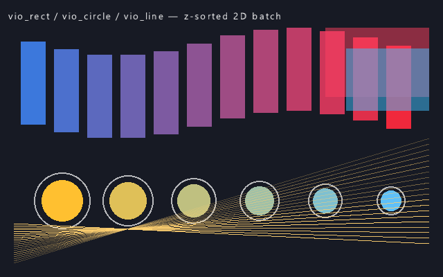 `vio_rect` / `vio_circle` / `vio_line`, z-sorted batch | 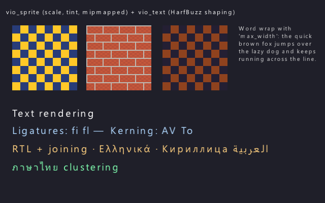 `vio_sprite` + `vio_text` (HarfBuzz shaping, RTL, Thai, word wrap) |
| 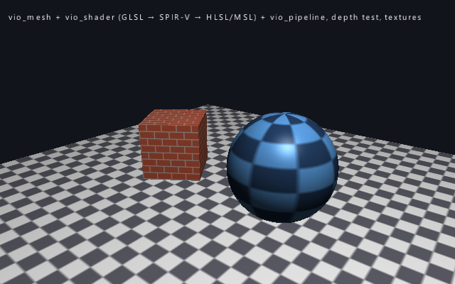 `vio_mesh` / `vio_shader` / `vio_pipeline`, GLSL → SPIR-V → HLSL/MSL | 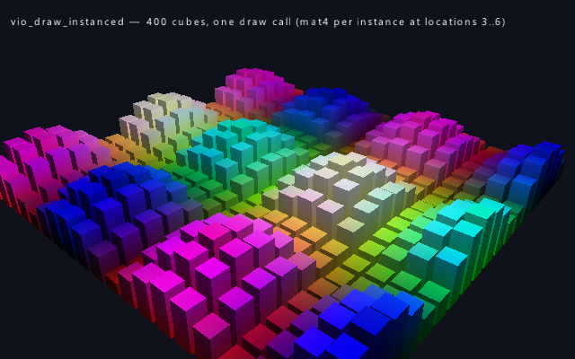 `vio_draw_instanced`, 400 cubes in one draw |
| 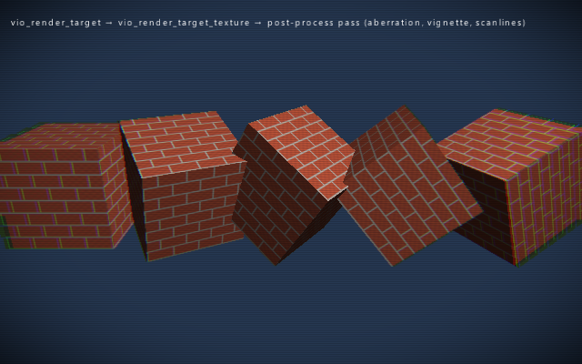 `vio_render_target` → post-process pass | 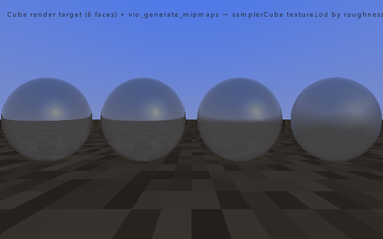 Cube render target + `vio_generate_mipmaps` → `textureLod` by roughness |
| 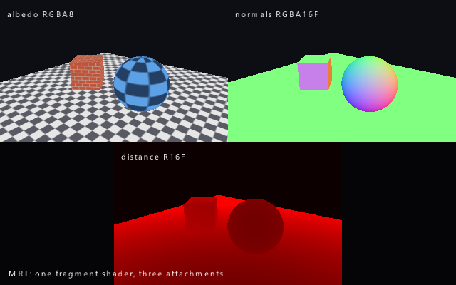 Multiple render targets (RGBA8 / RGBA16F / R16F) | 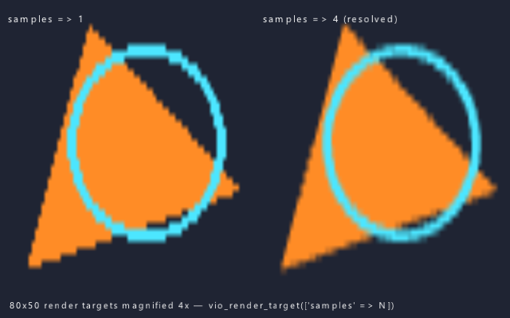 `['samples' => 4]` render target, resolved |
| 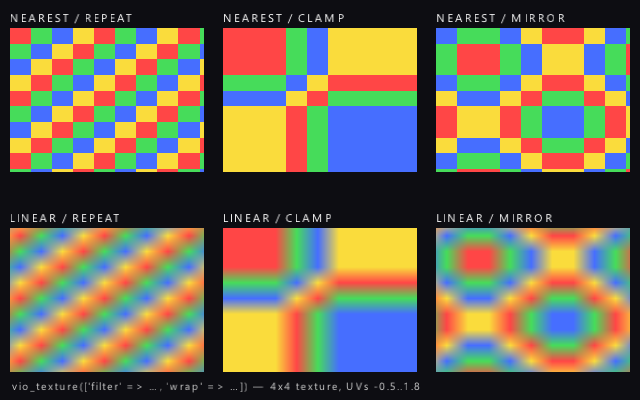 `filter` × `wrap` sampler grid | 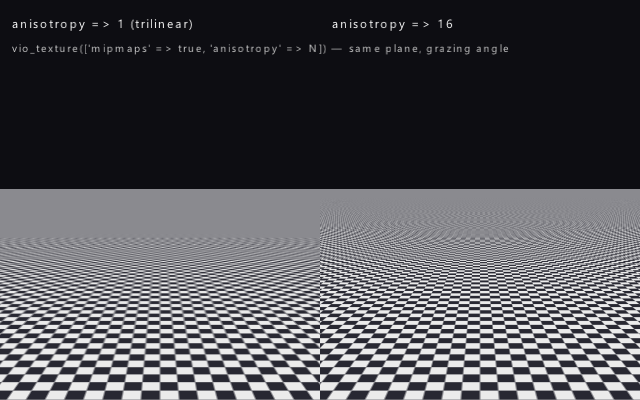 `['anisotropy' => 16]` vs. trilinear |
| 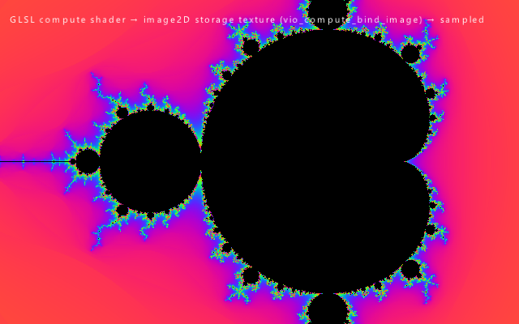 Compute shader → `image2D` storage texture | 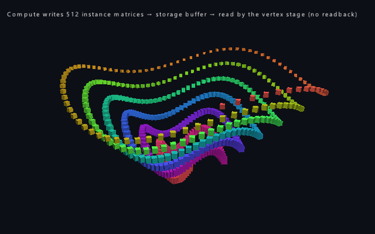 Compute writes instance matrices, the vertex stage reads them (no readback) |
| 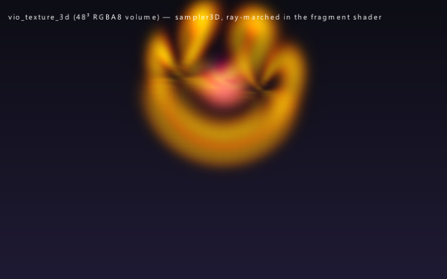 `vio_texture_3d` ray-marched via `sampler3D` | 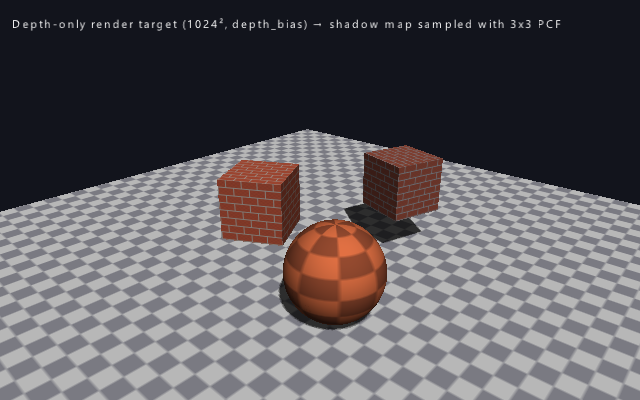 Depth-only render target → PCF shadows |
| 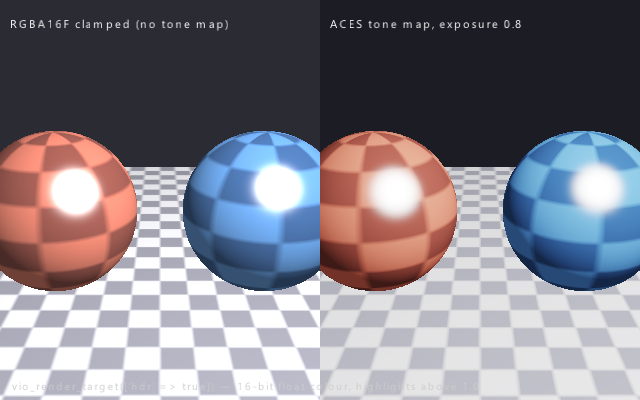 `['hdr' => true]` RGBA16F target + ACES | |

## Requirements

- PHP >= 8.5

All native libraries are optional — the extension compiles and runs without them, features are simply unavailable at runtime:

| Library | Feature | Build Flag |
|---------|---------|------------|
| [GLFW](https://www.glfw.org/) 3.4 | Windowing, input, gamepad | `--with-glfw` |
| [glslang](https://github.com/KhronosGroup/glslang) | GLSL to SPIR-V compilation | `--with-glslang` |
| [SPIRV-Cross](https://github.com/KhronosGroup/SPIRV-Cross) | Shader reflection & transpilation | `--with-spirv-cross` |
| [Vulkan SDK](https://vulkan.lunarg.com/) | Vulkan backend | `--with-vulkan` |
| [FFmpeg](https://ffmpeg.org/) | Video recording & streaming | `--with-ffmpeg` |
| Metal (macOS framework) | Metal backend | `--with-metal` |
| Direct3D 11 (Windows SDK) | Direct3D 11 backend | `--with-d3d11` (Windows, on by default) |
| Direct3D 12 (Windows SDK) | Direct3D 12 backend | `--with-d3d12` (Windows, on by default) |

## Installation

### Via PIE (PHP Installer for Extensions)

```bash
pie install phpolygon/php-vio
```

### Pre-built Binaries

Download platform-specific binaries from the [Releases](https://github.com/phpolygon/php-vio/releases) page. Available for:

- Linux x86_64 / ARM64
- macOS x86_64 (Intel) / ARM64 (Apple Silicon)
- Windows x64

### From Source (macOS)

```bash
brew install glfw glslang spirv-cross ffmpeg

phpize
./configure --enable-vio --with-glfw --with-glslang --with-spirv-cross \
  --with-vulkan --with-ffmpeg --with-metal
make -j$(sysctl -n hw.ncpu)
sudo make install
```

### From Source (Linux)

```bash
# Ubuntu/Debian
sudo apt install php-dev libglfw3-dev glslang-dev libvulkan-dev \
  libavcodec-dev libavformat-dev libavutil-dev libswscale-dev \
  spirv-cross libspirv-cross-c-shared-dev

phpize
./configure --enable-vio --with-glfw --with-glslang --with-spirv-cross \
  --with-vulkan --with-ffmpeg
make -j$(nproc)
sudo make install
```

### Windows

On Windows, no build toolchain is needed — PHP extensions are distributed as pre-compiled DLLs. Download the matching DLL from the [Releases](https://github.com/phpolygon/php-vio/releases) page (match your PHP version and thread-safety mode), then:

1. Copy `php_vio.dll` into your PHP `ext\` directory
2. Add `extension=vio` to your `php.ini`
3. Restart PHP / your web server

All backends use conditional compilation (`#ifdef HAVE_*`), so builds without certain dependencies compile fine — those features are simply unavailable at runtime.

## Quick Start

```php
<?php

// Create a window with OpenGL backend
$ctx = vio_create("opengl", [
    "width"  => 800,
    "height" => 600,
    "title"  => "Hello VIO",
]);

while (!vio_should_close($ctx)) {
    vio_begin($ctx);
    vio_clear($ctx, 0.1, 0.1, 0.1);

    // 2D drawing
    vio_rect($ctx, 50, 50, 200, 100, ["color" => 0xFF0000FF]);
    vio_circle($ctx, 400, 300, 60, ["color" => 0x00FF00FF]);
    vio_draw_2d($ctx);

    vio_end($ctx);
    vio_poll_events($ctx);
}

vio_close($ctx);
vio_destroy($ctx);
```

## API Overview

71 functions across these categories:

| Category | Functions |
|----------|-----------|
| Context | `vio_create`, `vio_begin`, `vio_end`, `vio_clear`, `vio_close`, `vio_destroy` |
| Input | `vio_key_pressed`, `vio_mouse_position`, `vio_mouse_button`, `vio_on_key` |
| 2D | `vio_rect`, `vio_circle`, `vio_line`, `vio_sprite`, `vio_text`, `vio_draw_2d` |
| 3D | `vio_mesh`, `vio_shader`, `vio_pipeline`, `vio_bind_pipeline`, `vio_draw` |
| Textures | `vio_texture`, `vio_bind_texture`, `vio_texture_load_async` |
| Fonts | `vio_font`, `vio_text`, `vio_text_measure`, `vio_font_load_async` |
| Buffers | `vio_uniform_buffer`, `vio_update_buffer` |
| Audio | `vio_audio_load`, `vio_audio_play`, `vio_audio_pause`, `vio_audio_stop` |
| Recording | `vio_recorder`, `vio_recorder_capture`, `vio_recorder_stop` |
| Streaming | `vio_stream`, `vio_stream_push`, `vio_stream_stop` |
| Headless | `vio_read_pixels`, `vio_save_screenshot`, `vio_compare_images` |
| Shaders | `vio_shader_reflect`, shader compilation via glslang |
| Plugins | `vio_plugins`, `vio_plugin_info` |

Full API documentation: see [vio.stub.php](vio.stub.php)

## Backends

| Backend | Status | Platforms |
|---------|--------|-----------|
| Direct3D 12 | Stable | Windows only |
| Direct3D 11 | Stable | Windows only |
| Metal | Stable | macOS only |
| OpenGL 4.1 | Stable | macOS, Linux, Windows |
| Vulkan | Experimental | macOS (MoltenVK), Linux, Windows |
| Null | Stable | All (for unit testing) |

Backend auto-selection is platform-specific:

- **Windows:** Direct3D 12 → Direct3D 11 → Vulkan → OpenGL
- **macOS:** Metal → OpenGL  (Vulkan via MoltenVK is opt-in, not auto)
- **Linux:** Vulkan → OpenGL

`Null` is never auto-selected; request it explicitly with `vio_create("null")` for headless tests. Override auto-selection per call (`vio_create("d3d11")`) or globally via the `vio.default_backend` INI setting.

## Performance: Metal vs OpenGL

Benchmarked on Apple M2 Pro (macOS 26.4, 1280x720, VSync off). Measures draw + flush time only (excludes present/VSync wait).

| Scenario | Metal (median) | OpenGL (median) | Delta |
|----------|---------------|----------------|-------|
| 500 rects | 192 us | 179 us | +7% |
| 200 rects + 200 rounded rects + 50 text | 323 us | 313 us | +3% |
| 1000 rects + 100 text | **301 us** | 374 us | **-20%** |

**Tail latency (frame time consistency):**

| Percentile | Metal | OpenGL |
|------------|-------|--------|
| p95 | 306-601 us | 437-754 us |
| p99 | 375-674 us | 907-953 us |

Metal is slightly slower on simple scenes due to command encoding overhead, but **20% faster on heavy scenes** (1000+ draw calls with text). More importantly, Metal delivers **30-40% better tail latency** — fewer frame time spikes and more consistent rendering.

## Testing

```bash
NO_INTERACTION=1 TEST_PHP_EXECUTABLE=$(which php) \
  php run-tests.php -d extension=$PWD/modules/vio.so tests/
```

93 PHPT tests, grouped by topic under `tests/` (`core/`, `backends/`, `render3d/`, `render2d/`, `input/`, `window/`, `media/`) — headless rendering with pixel verification, 2D/3D pipelines, shaders, compute, audio, input, and the per-backend capability matrix. `run-tests.php` recurses into the folders; pass a single folder to run one area.

## License

[MIT](LICENSE)
